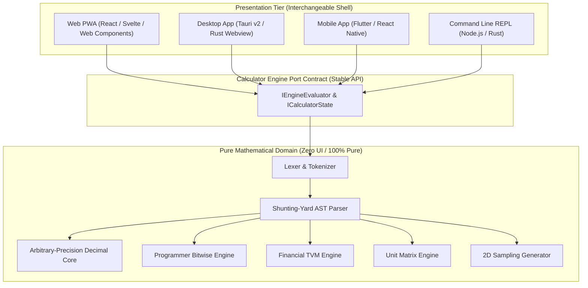

# Universal Calculator

> **An extensible, high-precision, multi-domain mathematical workbench designed for everyday productivity, engineering computation, and financial analysis.**

[](./docs/context/)
[](./docs/context/project/architecture.md)
[-purple)](./docs/context/project/decisions/002-numeric-precision-strategy.md)
[](./docs/context/system/constraints.md)
[](./docs/context/project/vision.md)

---

## 1. Executive Summary

Traditional calculators force an artificial compromise: basic four-function calculators lack scientific depth, while specialized scientific or programmer utilities are cumbersome for simple calculations.

**Universal Calculator** is a unified, modular computational suite that brings together **7 dedicated calculation modes** under a single fluid design language. Built on a strict **Hexagonal (Port-and-Adapter) architecture**, the mathematical engine operates as a 100% headless, pure library with zero UI dependencies. It eliminates IEEE 754 binary floating-point rounding errors (e.g. `0.1 + 0.2 === 0.3`), guarantees sub-millisecond execution, runs completely offline, and adheres to WCAG 2.2 AA accessibility standards.

---

## 2. Complete Feature Catalog & Modes

The calculator includes all features across 7 primary computational modes, plus an integrated audit tape and comprehensive UX capabilities:

```
┌───────────────────────────────────────────────────────────────────────────────────┐
│                           UNIVERSAL CALCULATOR WORKBENCH                          │
├─────────────────┬─────────────────┬──────────────────┬────────────────────────────┤
│ 1. Standard     │ 2. Scientific   │ 3. Programmer    │ 4. Financial               │
│ • BODMAS Precedence• Trig & Hyperbolic• HEX/DEC/OCT/BIN  │ • Loan / Mortgage EMI      │
│ • 0.1+0.2 Exact │ • Logs & Powers │ • 64-Bit Bitfield│ • Amortization Schedule    │
│ • Contextual %  │ • Factorial/nCr │ • Logic Gates    │ • Compound / Simple Int.   │
│ • Parentheses   │ • DEG/RAD/GRAD  │ • Two's Compl.   │ • TVM, Tax, Margin, Tip    │
├─────────────────┼─────────────────┼──────────────────┼────────────────────────────┤
│ 5. Converter    │ 6. Graphing     │ 7. History Tape  │ 8. UX & Accessibility      │
│ • 10 Dimensions │ • 2D y = f(x)   │ • Audit Tape Log │ • WCAG 2.2 AA Keyboard     │
│ • Bi-Directional│ • Multi-Curve   │ • Custom Notes   │ • Dark/Light/OLED Themes   │
│ • Physical Temp │ • Trace Cursor  │ • CSV/JSON Export│ • Live Expression Preview  │
│ • Digital Base  │ • Asymptote Fix │ • Memory (M+/MR) │ • Multi-Lingual Separators │
└─────────────────┴─────────────────┴──────────────────┴────────────────────────────┘
```

### 2.1. Standard Mode (`app/standard`)
- **Core Arithmetic**: Addition (`+`), Subtraction (`-`), Multiplication (`×`), Division (`÷`).
- **Exact Decimal Arithmetic**: Uses arbitrary-precision decimal mathematics to guarantee exact results without binary floating-point drift (e.g. `0.1 + 0.2 = 0.3`).
- **Algebraic Order of Operations**: Strict BODMAS / PEMDAS precedence without requiring manual bracket assembly for basic equations.
- **Parentheses Management**: Multi-level nested brackets with syntax highlighting and auto-balancing of unclosed parentheses on pressing `=`.
- **Contextual Percentage Logic**:
  - Direct percentage: `250 * 20% = 50`
  - Additive tax/markup: `100 + 15% = 115`
  - Subtractive discount: `100 - 15% = 85`
- **Ergonomic Controls**: Sign toggling (`+/-`), decimal point guard (prevents duplicate `..`), single-character backspace (`⌫`), Clear Entry (`CE`), and All Clear (`AC`).
- **Real-Time Live Preview**: Computes and displays formula results dynamically on a secondary display line as you type.

### 2.2. Scientific Mode (`app/scientific`)
- **Trigonometry**: Sine (`sin`), Cosine (`cos`), Tangent (`tan`), Cosecant (`csc`), Secant (`sec`), Cotangent (`cot`).
- **Inverse & Hyperbolic Trig**: `asin`, `acos`, `atan`, `sinh`, `cosh`, `tanh`, `asinh`, `acosh`, `atanh`.
- **Angular Modes**: Instant toggle between Degrees (`DEG`), Radians (`RAD`), and Gradians (`GRAD`) with prominent status badge.
- **Logarithmic & Exponential**: Natural log ($\ln$), base-10 log ($\log_{10}$), custom base log ($\log_y x$), natural exponent ($e^x$), base-10 exponent ($10^x$), base-2 exponent ($2^x$).
- **Powers & Roots**: $x^y$, $x^2$, $x^3$, $\sqrt{x}$, $\sqrt[3]{x}$, $\sqrt[y]{x}$.
- **Combinatorics & Discrete Math**: Factorials ($n!$), Combinations ($nCr$), Permutations ($nPr$), Modulo ($x \pmod y$), Absolute value ($|x|$).
- **Fundamental Constants**: High-precision constants for $\pi$ (Pi), $e$ (Euler's number), and $\phi$ (Golden ratio) expanding up to 100 decimal digits.
- **Scientific Notation**: Dedicated `EXP` / `EE` key for scientific numbers (e.g. `6.022e+23`).
- **Secondary Function Layer**: `2nd` / `Shift` toggle to alternate between primary and inverse operations.

### 2.3. Programmer Mode (`app/programmer`)
- **Multi-Radix Synchronous Display**: Simultaneous real-time views for Hexadecimal (`HEX`), Decimal (`DEC`), Octal (`OCT`), and Binary (`BIN`).
- **Interactive 64-Bit Bitfield**: 64 clickable bit blocks grouped into 4-bit nibbles; toggling any individual bit flips it between 0 and 1 and recalculates all four base rows instantly.
- **Configurable Word Sizes**: `BYTE` (8-bit), `WORD` (16-bit), `DWORD` (32-bit), `QWORD` (64-bit) with immediate masking of overflow bits.
- **Signed vs Unsigned Representation**: Two's Complement signed integer mode with explicit sign bit handling.
- **Bitwise Logic Gates**: `AND`, `OR`, `XOR`, `NOT`, `NAND`, `NOR`, `XNOR`.
- **Bit Shifts & Rotations**:
  - Logical Shift Left (`LSL`), Logical Shift Right (`LSR`).
  - Arithmetic Shift Right (`ASR` preserving sign bit).
  - Circular Rotate Left (`ROL`), Circular Rotate Right (`ROR`).
- **Endianness Flipping**: Byte swap tool between Big-Endian and Little-Endian byte orders.

### 2.4. Financial & Commercial Mode (`app/financial`)
- **Mortgage & Loan EMI**:
  - Computes exact monthly installment ($E = P \cdot \frac{r(1+r)^n}{(1+r)^n - 1}$).
  - Computes total cost of loan and total interest paid.
- **Month-by-Month Amortization Schedule**:
  - Virtualized breakdown displaying Opening Balance, Periodic Payment, Principal Component, Interest Component, and Closing Balance.
  - Cent-adjustment guarantee ensuring final payment terminates loan balance to exactly `$0.00`.
- **Simple & Compound Interest**:
  - Principal, rate %, tenure, and compounding intervals (Annually, Semi-Annually, Quarterly, Monthly, Daily).
- **Time Value of Money (TVM Solver)**:
  - Interrelated 5-variable solver for Present Value (`PV`), Future Value (`FV`), Payment (`PMT`), Periods (`N`), and Annual Interest Rate (`I/Y`).
- **Business & Commercial Formulas**:
  - Sales Tax / GST / VAT calculator (both Tax-Inclusive and Tax-Exclusive modes).
  - Profit Margin % and Markup % calculator.
  - Discount & Net Savings calculator.
  - Tip & Bill splitting calculator with guest head count.

### 2.5. Unit & Dimensional Converter (`app/converter`)
- **10 Core Physical Dimensions**:
  1. **Length**: Meters, Kilometers, Centimeters, Millimeters, Inches, Feet, Yards, Miles, Nautical Miles.
  2. **Mass & Weight**: Kilograms, Grams, Milligrams, Metric Tons, Pounds (lb), Ounces (oz), Stone.
  3. **Temperature**: Celsius, Fahrenheit, Kelvin, Rankine (with affine scale offset and Absolute Zero guard).
  4. **Volume**: Liters, Milliliters, Gallons (US), Quarts, Pints, Cups, Fluid Ounces, Cubic Meters.
  5. **Area**: Square Meters, Square Kilometers, Square Feet, Square Miles, Acres, Hectares.
  6. **Speed**: m/s, km/h, mph, Knots, Mach.
  7. **Time**: Milliseconds, Seconds, Minutes, Hours, Days, Weeks, Months, Years.
  8. **Digital Storage**: Bits, Bytes, KB, MB, GB, TB, PB (supporting both Base 10 `1000` and Binary `1024` KiB/MiB).
  9. **Energy**: Joules, Kilojoules, Calories, Kilocalories, Watt-hours, Kilowatt-hours (kWh), BTU.
  10. **Pressure**: Pascal, Kilopascal, Bar, PSI, Atmosphere (atm), Torr/mmHg.
- **Bi-Directional Live Sync**: Modifying either side updates the other instantaneously without recursion loops.
- **Unit Swap ($\rightleftarrows$)**: One-click swap to reverse source and target units.

### 2.6. 2D Graphing Mode (`app/graphing`)
- **Cartesian Curve Plotter**: Plot single or multi-variable functions $y = f(x)$ with powers, trig waves, and rationals.
- **Multi-Curve Overlays**: Plot up to 4 functions simultaneously with high-contrast color coding.
- **Interactive Navigation**: Drag to pan, scroll wheel or pinch to zoom, and one-click "Home" reset button.
- **Interactive Trace Cursor**: Hover along any plotted curve to inspect exact $(x, y)$ coordinate tooltips.
- **Analysis Pinning**: Automatic detection and marker dots for real roots ($X$-intercepts), $Y$-intercepts, and local extrema.
- **Singularity & Asymptote Protection**: Prevents vertical artifact lines across poles (e.g. $y = \tan x$ or $y = 1/x$).

### 2.7. Calculation Tape & Memory Management (`app/history`)
- **Persistent Calculation Tape**: Chronological audit trail preserving expressions, results, timestamps, and mode tags.
- **Custom Annotations**: Add text notes to past calculations (e.g. "Monthly Electricity", "Subnet Mask").
- **Click-to-Recall**: Click expression to re-populate active editor; click result to copy or append as operand.
- **Classical & Multi-Slot Memory**: Full support for `MC`, `MR`, `M+`, `M-`, `MS`, plus named registers `M1`, `M2`, `M3`.
- **Audit Export**: Export calculation history to RFC 4180 CSV, JSON, or formatted plain text.
- **Safe Purge Guard**: Destructive clear requires confirmation to prevent accidental data loss.

### 2.8. User Experience & Accessibility
- **WCAG 2.2 AA Compliance**: Contrast ratios $\ge 4.5:1$, visible focus rings, and screen reader announcements (`aria-live="polite"`).
- **Comprehensive Keyboard Support**: Full hardware keyboard and physical numpad mapping.
- **Visual Design**: Sleek Dark Mode, crisp Light Mode, and OLED Pure Black mode.
- **Internationalization**: Locale-aware number formatting (comma `,` vs dot `.` decimal delimiters).

---

## 3. Technology Stack Strategy & Evaluation

> **Notice**: The technology stack for this project is deliberately flexible and decoupled. The architectural priority is that the **Core Math Engine** remains 100% agnostic to whatever presentation framework is selected.

### 3.1. Architecture Decoupling (Hexagonal Architecture)



### 3.2. Presentation Stack Trade-Off Matrix

| Stack Option | Implementation | Startup Time | Memory | Cross-Platform Reach | Recommendation Verdict |
| :--- | :--- | :--- | :--- | :--- | :--- |
| **Option A: Web PWA** | TypeScript + Vite + React / Svelte / Web Components | < 150ms | 30–50 MB | Web, Desktop (installable PWA), Mobile | **Tier 1 (Recommended for Phase 1)** |
| **Option B: Tauri v2** | Rust backend + Web frontend | < 80ms | 15–25 MB | macOS, Windows, Linux, Android, iOS | **Best for dedicated desktop app bundle** |
| **Option C: Electron** | Node.js + Chromium shell | ~800ms | 120–200 MB | macOS, Windows, Linux | **Rejected (unnecessary memory overhead)** |
| **Option D: Flutter** | Dart Native Engine | < 200ms | 40–60 MB | iOS, Android, macOS, Windows | **Alternative if 100% native mobile prioritized** |

### 3.3. Math Engine Evaluation

1. **Pure TypeScript Engine (`decimal.js` / custom BigInt fixed-point)**:
   - **Advantages**: Runs natively everywhere (browser, Node, web workers, mobile webviews) with zero build overhead.
   - **Precision**: Easily configured for 34–100+ decimal digits.
   - **Verdict**: Recommended primary engine for rapid delivery and maximum portability.
2. **Rust Core compiled to WebAssembly (WASM)**:
   - **Advantages**: Peak compute performance for heavy operations (e.g. generating $10^6$ graphing points or large matrix transformations).
   - **Verdict**: Available as an opt-in Web Worker acceleration module for Phase 2/3.

---

## 4. Hardware Keyboard Shortcut Reference

| Key / Shortcut | Standard Function | Scientific Function | Programmer Function |
| :--- | :--- | :--- | :--- |
| `0` – `9` | Digit input | Digit input | Valid digits in active base |
| `A` – `F` | Disabled | Disabled | Hexadecimal digits (`HEX` mode) |
| `+`, `-`, `*`, `/` | Basic operators | Basic operators | Bitwise addition, subtraction |
| `.` | Decimal point | Decimal point | Disabled (integer mode) |
| `(` and `)` | Parentheses | Nested formula brackets | Precedence brackets |
| `Enter` or `=` | Evaluate & Commit | Evaluate & Commit | Evaluate & Commit |
| `Backspace` | Delete last token | Delete last token | Delete last digit |
| `Escape` / `c` | Clear Entry (`CE`) | Clear Entry (`CE`) | Clear Entry (`CE`) |
| `Shift + Escape` | All Clear (`AC`) | All Clear (`AC`) | All Clear (`AC`) |
| `s`, `c`, `t` | — | `sin(`, `cos(`, `tan(` | — |
| `p` | — | Insert $\pi$ | — |
| `e` | — | Insert Euler's $e$ | Hex digit `E` |
| `&`, `\|`, `^`, `~` | — | — | `AND`, `OR`, `XOR`, `NOT` |
| `<`, `>` | — | — | Shift left (`LSL`), Shift right (`LSR`) |
| `Alt + 1` – `Alt + 6` | Switch to Standard | Switch to Scientific | Switch to Programmer |
| `Alt + H` | Open History Tape | Open History Tape | Open History Tape |

---

## 5. Documentation Architecture (`docs/context/`)

The repository adheres 100% to Google Open Knowledge Format (OKF v0.2) and StayPlan Stage 2 specification standards:

```text
docs/context/
├── README.md                                  # Context entrypoint & navigation
├── index.md                                   # Root progressive disclosure index
├── project/
│   ├── vision.md                              # Product vision, principles, and non-goals
│   ├── tech.md                                # Technology stack evaluation & strategy
│   ├── architecture.md                        # Macro system topology & AST pipeline
│   ├── actors.md                              # User personas & actor profiles
│   ├── glossary.md                            # Mathematical & technical glossary
│   ├── domain-rules.md                        # Invariants, error rules, and math contracts
│   ├── conventions.md                         # Engineering conventions & test standards
│   └── decisions/                             # Architectural Decision Records (ADRs)
│       ├── 001-initial-architecture.md        # ADR 001: Decoupled Core Math Engine
│       ├── 002-numeric-precision-strategy.md  # ADR 002: Arbitrary-Precision Decimals
│       └── 003-ast-expression-parser.md       # ADR 003: AST Shunting-Yard Parser
├── system/
│   ├── start-here.md                          # Developer onboarding guide
│   ├── stack.md                               # System layers & interface contracts
│   └── constraints.md                         # Latency, precision, and WCAG constraints
├── features/app/                              # Discrete 3-File Feature Slices
│   ├── standard/evaluate-arithmetic/          # feature.md, flow.md, cases.md
│   ├── scientific/calculate-advanced-math/    # feature.md, flow.md, cases.md
│   ├── programmer/bitwise-radix-conversion/   # feature.md, flow.md, cases.md
│   ├── financial/compute-loan-interest/       # feature.md, flow.md, cases.md
│   ├── converter/convert-units/               # feature.md, flow.md, cases.md
│   ├── graphing/plot-functions/               # feature.md, flow.md, cases.md
│   └── history/manage-calculation-tape/       # feature.md, flow.md, cases.md
└── journeys/app/                              # Macro User Journeys
    ├── standard-daily-calculation.md          # Everyday shopping & discount journey
    ├── programmer-binary-debugging.md         # Systems engineer bitwise debugging
    └── financial-mortgage-planning.md         # Mortgage planning & amortization export
```

---

## 6. Verification & Quality Gates

Validate document conformance and specification integrity using the built-in OKF tools:

```bash
# Validate 100% OKF syntax, frontmatter, and rule-to-case traceability
node --experimental-strip-types ~/.gemini/config/plugins/stayplan/skills/stayplan-okf/scripts/stayokf.ts validate

# Verify strict repository compliance
node --experimental-strip-types ~/.gemini/config/plugins/stayplan/skills/stayplan-okf/scripts/stayokf.ts validate --strict-repo

# Refresh progressive disclosure directory indices
node --experimental-strip-types ~/.gemini/config/plugins/stayplan/skills/stayplan-okf/scripts/stayokf.ts index --write
```

---

## 7. Development Roadmap

- [x] **Phase 1: Architecture & Specification (Complete)**
  - Authored comprehensive product vision, architectural blueprint, domain rules, and mathematical invariants.
  - Specified 7 multi-domain 3-file feature slices with 100% rule-to-case test coverage.
  - Formulated technology stack evaluation and hexagonal decoupling strategy.
- [ ] **Phase 2: Core Math Engine Implementation**
  - Implement token lexer and Shunting-Yard AST parser.
  - Integrate arbitrary-precision decimal core (`decimal.js` wrapper).
  - Implement domain evaluators (Standard, Scientific, Programmer, Financial, Converter, Graphing).
  - Pass 10,000+ automated mathematical test vectors.
- [ ] **Phase 3: Presentation UI & Reactive Keypads**
  - Build responsive Web UI with dark/light/OLED themes and WCAG 2.2 AA accessibility.
  - Implement dual-line display with live preview and syntax highlighting.
  - Build interactive 64-bit bitfield, amortization schedule table, and 2D graphing canvas.
  - Implement persistent calculation tape and IndexedDB memory storage.
- [ ] **Phase 4: Cross-Platform Distribution**
  - Package PWA with service worker offline caching.
  - Build Tauri v2 native bundles for macOS, Windows, and Linux.
