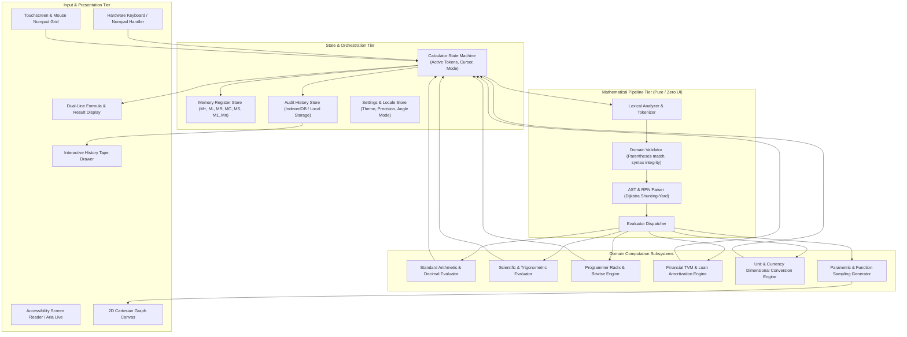
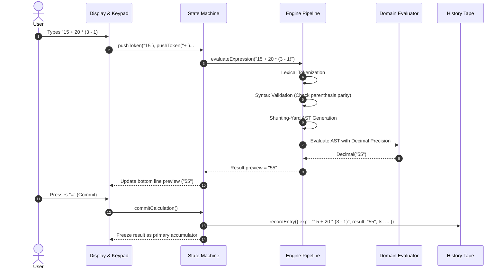

# Universal Calculator System Architecture

## 1. Overview & Architectural Blueprint

The Universal Calculator is built upon a **Decoupled Engine & Reactive Surface** pattern. The computational core operates as an isolated, side-effect-free mathematical engine, while the presentation surface handles input capture, layout adaptation, accessibility announcements, and reactive visualization.

---

## 2. Component Boundaries & Responsibilities

### 2.1. Presentation & Input Tier
- **Display Component**: Renders the multi-line interface:
  - Top expression line: Displays the complete mathematical formula with syntax highlighting (operands in cyan, operators in amber, parentheses matched with subtle colors).
  - Bottom result line: Displays the live evaluation preview as the user types, transitioning to confirmed result on pressing `=` or `Enter`.
- **Keypad Matrix Component**: Dynamically adapts to active mode (Standard 4x5 grid, Scientific 6x6 expanded grid, Programmer bitfield grid).
- **Accessibility Engine**: Manages `aria-live="polite"` regions so screen readers verbalize results, errors, and mode transitions without latency.

### 2.2. State & Orchestration Tier
- **Calculator State Machine**: Manages the current expression buffer, cursor position, selected angle mode (`DEG` | `RAD` | `GRAD`), base mode (`HEX` | `DEC` | `OCT` | `BIN`), and active word size (`8`, `16`, `32`, `64` bits).
- **Memory Store**: Maintains persistent memory registers (`M+`, `M-`, `MR`, `MC`, `MS`) and multi-slot named registers (`M1`, `M2`, `M3`).
- **History Tape Store**: Appends immutable records of committed calculations with timestamps, raw expression, evaluated result, and optional user annotations.

### 2.3. Mathematical Pipeline Tier
- **Lexer**: Converts raw character streams into typed mathematical tokens:
  - `NUMBER`, `OPERATOR_BINARY`, `OPERATOR_UNARY`, `FUNCTION`, `LPAREN`, `RPAREN`, `CONSTANT`, `COMMA`.
- **Parser (Shunting-Yard Algorithm)**: Converts infix token stream into either:
  1. Reverse Polish Notation (RPN) queue for stack-based execution.
  2. Abstract Syntax Tree (AST) for symbolic verification and graphing.
- **Precision Evaluator**: Executes operations using an arbitrary-precision decimal representation (e.g., 34–100 decimal digits) to completely prevent IEEE 754 floating-point inaccuracies.

---

## 3. Mathematical Evaluation Pipeline Detail

---

## 4. Security & Safety Boundaries

1. **Strict Zero-Eval Policy**:
   - The application **NEVER** uses JavaScript's `eval()`, `new Function()`, or dynamic script execution. All mathematical parsing is performed through a deterministic, hand-written recursive descent or Shunting-Yard parser.
   - Prevents code injection, prototype pollution, and arbitrary script execution.
2. **Infinite Recursion & DOS Fencing**:
   - Expression length capped at 4,096 tokens per formula.
   - Factorial operations capped at $n \le 10,000$ to prevent CPU freeze.
   - Graph sampling limited to 2,000 coordinate points per frame with rendering offloaded to requestAnimationFrame / Web Worker.
3. **Local Storage Sandboxing**:
   - All history data is saved locally in browser IndexedDB or native sandboxed storage. No sensitive computation data leaves the client sandbox.

---

## 5. Architectural References

- [Product Vision](./vision.md)
- [Technology Stack Strategy](./tech.md)
- [Domain Rules & Mathematical Invariants](./domain-rules.md)
- [Mathematical Terminology Glossary](./glossary.md)
- [Target Actors & User Personas](./actors.md)
