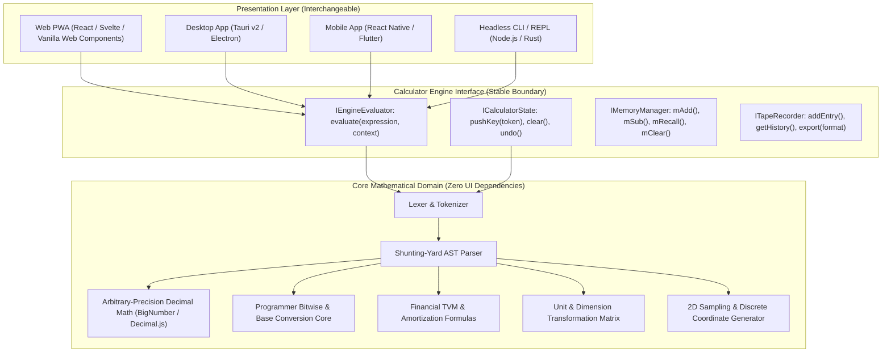

# Calculator Technology Stack Strategy & Evaluation

## 1. Overview & Architectural Philosophy

The technology stack for the Universal Calculator is **intentionally decoupled and flexible**. Rather than coupling mathematical logic to a specific UI framework, the application enforces a strict **Hexagonal Architecture (Ports and Adapters)**:

By maintaining this explicit boundary, the core mathematical engine can be implemented once, thoroughly fuzz-tested, and bound to whichever presentation stack best serves the deployment target.

---

## 2. Presentation Layer Candidate Evaluation

The following matrix compares the leading technology options for the calculator UI:

| Platform Vector | Candidate Stack | Startup Time | Memory Footprint | Cross-Platform Reach | Offline Capability | Recommendation Score |
| :--- | :--- | :--- | :--- | :--- | :--- | :--- |
| **Option A: Modern Web (PWA)** | TypeScript + Vite + React / Svelte / Web Components | < 150ms | 30–50 MB | Web, Mobile, Desktop via PWA install | Native Service Worker + IndexedDB | **Primary Choice (Tier 1)** |
| **Option B: Lightweight Native Desktop** | Tauri v2 (Rust backend + Web frontend) | < 80ms | 15–25 MB | macOS, Windows, Linux, Android, iOS | Local SQLite / File System | **Best for Desktop OS integration** |
| **Option C: Heavy Native Desktop** | Electron + Node.js | ~800ms | 120–200 MB | macOS, Windows, Linux | Local File System | **Rejected (excessive bloat for calculator)** |
| **Option D: Multi-Platform Native Mobile** | Flutter / Dart | < 200ms | 40–60 MB | iOS, Android, macOS, Web, Windows | SQLite / Hive | **Alternative if pure native mobile UX prioritized** |

### Evaluation Takeaways:
1. **Web PWA with Modern TypeScript**:
   - Zero install barrier, instant link sharing, responsive across all screen sizes.
   - PWA caching provides 100% offline functionality.
   - Ideal foundation for rapid prototyping and universal delivery.
2. **Tauri v2**:
   - If a standalone desktop installer (`.dmg`, `.exe`, `.deb`) is required, Tauri offers 1/10th the memory footprint of Electron and native global hotkey integration (e.g. `Cmd + Shift + Space` quick-launch calculator overlay).

---

## 3. Mathematical Engine Implementation Strategy

Calculators must never use raw JavaScript/native floating-point IEEE 754 arithmetic for decimal calculations:
- `0.1 + 0.2 = 0.30000000000000004` (Unacceptable in financial/standard modes).
- `9999999999999999 - 1 = 9999999999999999` (Loss of integer precision past $2^{53} - 1$).

### Mathematical Engine Options:

1. **Option 1: Pure TypeScript Arbitrary-Precision Engine**
   - Libraries: `decimal.js`, `bignumber.js`, or custom BigInt fixed-point engine.
   - **Pros**: Zero compilation step, runs identically in browser, Node.js, and mobile web views; trivial debugging and fast iteration.
   - **Precision**: Configurable precision up to 100+ significant digits.
   - **Recommendation**: Best for initial implementation and web deployment.

2. **Option 2: Rust Math Engine compiled to WebAssembly (WASM)**
   - Crates: `rust_decimal`, `num-bigint`, `rug`.
   - **Pros**: Microsecond performance for heavy 2D graphing sampling ($10^6$ points) and matrix operations; identical binary shared between Tauri desktop and Web WASM.
   - **Cons**: WASM bridge boundary overhead for single-keystroke arithmetic; slightly higher build complexity.
   - **Recommendation**: Optional performance upgrade for graphing/matrix modules in Phase 2.

---

## 4. Local Persistence & State Management

Calculator history, persistent memory registers (`M1`, `M2`, `M3`), custom unit presets, and UI preferences (theme, angle mode) require persistent client-side storage:

- **Storage Adapter**:
  - Web/PWA: `IndexedDB` (via `idb` or `Dexie.js`) for calculation history tape; `localStorage` for lightweight UI settings (theme, DEG/RAD toggle).
  - Desktop (Tauri): Local JSON store or embedded SQLite.
- **Data Retention & Privacy**:
  - 100% on-device storage.
  - Zero external telemetry or network calls.
  - Export capabilities in CSV, JSON, and formatted plain text.

---

## 5. Technology Stack Phasing Recommendation

- **Phase 1 (Foundation)**:
  - Engine: Modular TypeScript math engine using pure functional expression parsing and `decimal.js` for arbitrary-precision arithmetic.
  - Presentation: Responsive Web UI built with Vite, TypeScript, and modern CSS (tokens, CSS grid, container queries).
  - Packaging: Standard Progressive Web App (PWA) manifest with service worker caching.
- **Phase 2 (Cross-Platform Distribution)**:
  - Wrap existing Web UI with Tauri v2 to generate native macOS, Windows, and Linux standalone applications with system tray support.
- **Phase 3 (High-Compute Modules)**:
  - If 3D plotting or heavy statistical regressions are introduced, offload computation to a Web Worker or Rust WASM module.
